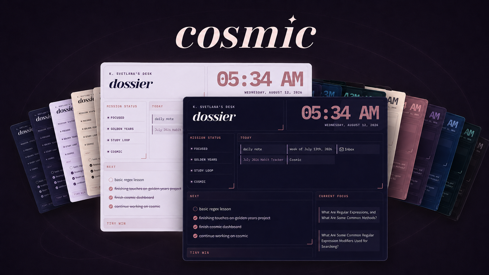

# Cosmic for Obsidian

A colorful, customizable theme for [Obsidian](https://obsidian.md/), inspired by painted night skies.

Cosmic pairs deep, atmospheric surfaces with expressive color, readable typography, and coordinated light and dark modes. It includes seven complete color schemes, optional workspace atmospheres, and focused customization through the Style Settings plugin.



[Install Cosmic from Obsidian](obsidian://show-theme?name=Cosmic)

## Features

- Coordinated light and dark mode
- Seven complete color schemes
- Colorful headings and interface accents
- Adjustable workspace backgrounds and sidebar contrast
- Customizable typography, note width, and interface density
- Continuous, readable code blocks with colorful syntax highlighting
- Styled tables, properties, callouts, embeds, Canvas, Graph, Bases, and PDF views
- Colored highlights and grouped Bases/card views for current Obsidian releases
- Styled editor focus, search, footnotes, media controls, outlines, backlinks, and bookmarks
- Semantic alternate checkboxes
- Optional per-note layouts for cards, images, tables, properties, and wide media
- Print-friendly and reduced-motion styles
- Responsive adjustments for smaller screens

cosmic does not require any companion plugins to function. The optional [Style Settings](https://github.com/mgmeyers/obsidian-style-settings) plugin unlocks the theme's built-in customization controls.

## Technical Design

Cosmic is built as a standalone CSS theme that extends Obsidian's existing interface without requiring companion plugins. The theme uses reusable CSS custom properties and Obsidian's design tokens to coordinate seven color systems across light and dark modes.

The stylesheet includes responsive layouts, print-specific styling, reduced-motion support, forced-colors accessibility handling, and optional Style Settings configuration. Custom CSS classes provide reusable per-note layouts without requiring changes to note content or application code.

## Installation

### Obsidian Community Themes

Cosmic is available in the Obsidian Community Themes directory:

1. Open **Settings > Appearance**
2. Next to **Themes**, select **Manage**
3. Search for **Cosmic**
4. Select **Install and use**

### Manual Installation

1. Download `theme.css` and `manifest.json` from the latest GitHub release
2. Create a folder named `cosmic` inside your vault's `.obsidian/themes/` directory
3. Place `theme.css` and `manifest.json` inside the `cosmic` folder
4. Restart Obsidian or reload the available themes
5. Open **Settings > Appearance** and select **cosmic**

Your theme directory should look like this:

```text
.obsidian/
└── themes/
    └── cosmic/
        ├── manifest.json
        └── theme.css
```

## Color Schemes

cosmic includes seven palettes. Every palette has separate colors designed for light and dark mode, respectively.

To change palettes with Style Settings:

1. Install and enable the [Style Settings](https://github.com/mgmeyers/obsidian-style-settings) community plugin
2. Open **Settings > Style Settings**
3. Expand **Cosmic**
4. Under **Colors and Moods**, select a **Color Scheme**

Changing between Obsidian's light and dark appearance automatically activates the corresponding version of the selected palette.

## Style Settings

The full list of cosmic's customizable options under Style Settings are as follows:

### Colors and Moods
- Choose one of cosmic's seven color schemes (Original, Red Dwarf, Blue Blob, Aurora, Eclipse, Stardust, & Comet)
- Change the primary accent and hover accent
- Customize the colors used for H1, H2, and H3 headings

### Fonts and Headings

- Choose the main note font
- Choose the display font used for titles and prominent headings

Cosmic's default typography uses:

- **Yeseva One** for prominent headings
- **Tirra** for note text
- **Inter** for the interface
- **IBM Plex Mono** for inline code and code blocks

Alternative heading and note fonts are available through Style Settings.

### Size and Spacing

- Adjust the maximum note width
- Choose **Cozy**, **Compact**, or **Airy** interface spacing

### Backgrounds and Surfaces

Choose a sidebar treatment:

- **Muted**
- **Separated**
- **Deep**, available in dark mode

Choose a workspace background:

- **Flat** for a plain, uniform workspace
- **Nebula** for broad, palette-colored clouds and ambient glow
- **Deep Space** for a near-black star field with restrained color and a stronger vignette

### Finishing Touches

- Choose **Soft**, **Solid**, or **Outlined** callouts
- Choose **Default**, **Pill**, or **Minimal** status bar styling
- Remove frames from embedded notes and files
- Turn off ambient glow, decorative shadows, and transitions

## Callouts

cosmic styles Obsidian's standard callouts and includes three additional callout styles:

```markdown
> [!constellation]
> A highlighted idea or collection of related notes.

> [!orbit]
> Supporting information connected to a larger topic.

> [!signal]
> An important message, observation, or update.
```

The active cosmic palette supplies the colors for these callouts.

## Alternate Checkboxes

cosmic provides distinct colors and symbols for several semantic task states.

| Syntax | Meaning |
| --- | --- |
| `- [ ]` | Incomplete |
| `- [x]` | Complete |
| `- [/]` | In progress |
| `- [!]` | Important |
| `- [?]` | Question |
| `- [*]` | Star |
| `- [>]` | Forwarded |
| `- [-]` | Cancelled |
| `- [i]` | Information |

## Per-note Layouts

cosmic includes optional CSS classes that can change the presentation of individual notes without affecting the rest of the vault.

Add classes through the note's `cssclasses` property:

```yaml
---
cssclasses:
  - cosmic-image-grid
---
```

Multiple classes can be combined.

### Content Layouts

| CSS class | Effect |
| --- | --- |
| `cosmic-card-grid` | Arranges supported content blocks and callouts in a responsive card grid |
| `cosmic-image-grid` | Arranges groups of images in a responsive gallery |
| `cosmic-list-cards` | Turns a top-level list into a responsive card layout |
| `cosmic-wide-media` | Allows images, videos, iframes, and embeds to extend beyond the normal note width |

### Properties

| CSS class | Effect |
| --- | --- |
| `cosmic-properties-card` | Displays note properties in a card-style grid |
| `cosmic-properties-compact` | Reduces property spacing |
| `cosmic-properties-plain` | Removes the surrounding properties treatment |

### Tables

| CSS class | Effect |
| --- | --- |
| `cosmic-table-compact` | Reduces table cell spacing |
| `cosmic-table-center` | Centers the table and its cell content |
| `cosmic-table-nowrap` | Prevents table-cell text from wrapping |
| `cosmic-table-striped` | Adds alternating row backgrounds |
| `cosmic-table-numbered` | Adds visible row numbers |

### Code Blocks

| CSS class | Effect |
| --- | --- |
| `cosmic-code-nowrap` | Prevents code lines from wrapping |
| `cosmic-code-lines` | Adds line numbers in Live Preview |
| `cosmic-code-compact` | Reduces code-block spacing |

Cosmic intentionally renders code blocks as one continuous container rather than styling each line as a separate rounded element.

## Fonts

Cosmic embeds its primary typefaces directly in `theme.css`, so its typography works offline without loading assets from the network.

The bundled typefaces are Cormorant Garamond, IBM Plex Mono, Inter, Source Serif 4, Tirra, and Yeseva One. Copyright notices and license details are available in [FONT-LICENSES.md](./FONT-LICENSES.md).

You can also override Obsidian's interface, text, or monospace fonts through Obsidian's built-in font settings.

## Compatibility

Cosmic requires Obsidian `1.5.0` or later and includes styling for current Obsidian features, including colored highlights and grouped Bases views.

The theme includes adjustments for narrow screens, printing, reduced-motion preferences, and forced-colors accessibility mode. Because cosmic modifies many parts of Obsidian's interface, future Obsidian updates or unrelated CSS snippets may occasionally cause visual conflicts.

If you encounter a problem, temporarily disable other CSS snippets before reporting it.

## Feedback and contributing

Bug reports, feature requests, and pull requests are welcome through the project's [GitHub Issue Tracker](https://github.com/kaymade/cosmic/issues).

See [CONTRIBUTING.md](./CONTRIBUTING.md) for the reproduction details and visual checks that make reports and pull requests easier to review.

When reporting a visual problem, please include:

- Your Obsidian version
- Your operating system
- Whether you are using light or dark mode
- The selected cosmic color scheme
- A screenshot of the affected area
- Any CSS snippets or appearance-related plugins that may be active

## License

Cosmic is available under the [MIT License](./LICENSE).
